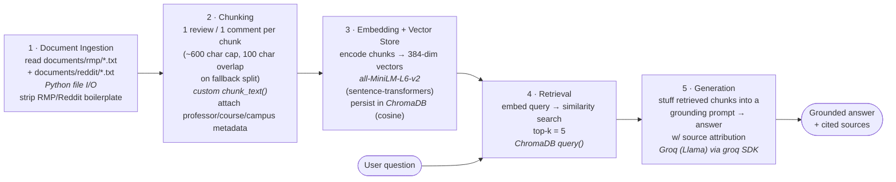

# Project 1 Planning: The Unofficial Guide

> Write this document before you write any pipeline code.
> Your spec and architecture diagram are what you'll use to direct AI tools (Claude, Copilot, etc.) to generate your implementation — the more specific they are, the more useful the generated code will be.
> Update the Retrieval Approach and Chunking Strategy sections if you change your approach during implementation.
> Update this file before starting any stretch features.

---

## Domain

<!-- What domain did you choose? Why is this knowledge valuable and hard to find through official channels? -->

**Rutgers University computer science course & professor reviews** (multi-campus — primarily New Brunswick, with some Newark).

This guide collects student-written reviews of Rutgers CS professors and courses from RateMyProfessors professor pages and r/rutgers discussion threads. This knowledge is hard to find through official channels because the course catalog and registrar tell you what a class *covers* but never how a professor actually *teaches* it — whether exams track the lectures, whether sections are coordinated so the instructor barely matters, how a grader handles partial credit, or which professor makes a notoriously hard course manageable. That signal is scattered across hundreds of short, anonymous, and sometimes contradictory reviews, which is exactly what a retrieval system can consolidate into a direct answer.

> Note on scope: the corpus spans more than one Rutgers campus. The Reddit threads are New Brunswick (CS111/CS112 with Goel & Centeno, `ds.cs.rutgers.edu`); several RateMyProfessors professors teach Newark course numbers (CS101/102, OS332, etc.). Each source is campus-tagged in the table below so retrieval and evaluation stay honest.

---

## Documents

<!-- List your specific sources: URLs, subreddit names, forum threads, or file descriptions.
     Aim for at least 10 sources that together cover different subtopics or perspectives within your domain. -->

| # | Source | Description | URL or location |
|---|--------|-------------|-----------------|
| 1 | RateMyProfessors — Mousumi Chakrabarty (CS, Newark) | 13 short reviews; highly rated (4.8); CS101/102/342, OS332, Mobile App Dev. Reviews emphasize clarity, caring, easy exams. | [ratemyprofessors.com/professor/2526357](https://www.ratemyprofessors.com/professor/2526357) · `documents/rmp/chakrabarty_mousumi.txt` |
| 2 | RateMyProfessors — Charles Edeki (CS, Newark) | Only 2 reviews, both 1-star; CS280. Sharp negative outlier — useful for testing low-coverage retrieval. | ratemyprofessors.com (search "Charles Edeki Rutgers") · `documents/rmp/edeki_charles.txt` |
| 3 | RateMyProfessors — Joseph Elliot (CS, Newark) | 11 polarized reviews (2.3 overall); CS102/251/335/347/348/490. Recurring complaint: reads off slides, weak delivery. | [ratemyprofessors.com/professor/2528771](https://www.ratemyprofessors.com/professor/2528771) · `documents/rmp/elliot_joseph.txt` |
| 4 | RateMyProfessors — Jerry Illanovsky (CS, Newark) | 17 reviews, bimodal (lots of 5s and 1s); CS101/102/198/288/335, Intensive Programming. Strong disagreement across students. | ratemyprofessors.com (search "Jerry Illanovsky Rutgers") · `documents/rmp/illanovsky_jerry.txt` |
| 5 | RateMyProfessors — Bruno Richard (CS, Newark) | 3 reviews; CS220 Data Visualization (project-heavy, R/atom, no exams). Niche elective coverage. | [ratemyprofessors.com/professor/2584799](https://www.ratemyprofessors.com/professor/2584799) · `documents/rmp/richard_bruno.txt` |
| 6 | RateMyProfessors — Nicole Richardson (CS, Newark) | 14 reviews (3.3); "Everyday Data" / data-science courses. Divisive: "tough grader but you learn a lot." | ratemyprofessors.com (search "Nicole Richardson Rutgers") · `documents/rmp/richardson_nicole.txt` |
| 7 | r/rutgers thread — "Intro to CS: Goel or Centeno" (New Brunswick) | Multi-comment thread comparing two CS111 lecturers; key fact: CS111 is coordinated across sections. | [reddit.com/r/rutgers/comments/1lmx2yk](https://www.reddit.com/r/rutgers/comments/1lmx2yk/intro_to_cs_goel_or_centeno/) · `documents/reddit/cs111_goel_centeno_threads.txt` |
| 8 | r/rutgers thread — "How is Professor Mark Russo for Data Structures (CS112)?" (New Brunswick) | Short Q&A thread; sparse direct info on Russo, more about Goel/Centeno. Tests partial-answer handling. | [reddit.com/r/rutgers/comments/1h18b2n](https://www.reddit.com/r/rutgers/comments/1h18b2n/how_is_professor_mark_russo_for_data_structures/) · `documents/reddit/cs112_mark_russo_threads.txt` |
| 9 | r/rutgers thread — "Preparation for Data Structures (CS112)" (New Brunswick) | Study-resource thread (course site, Big-O, prior exams, video links). Long, advice-dense comments. | [reddit.com/r/rutgers/comments/1i0ko6o](https://www.reddit.com/r/rutgers/comments/1i0ko6o/preparation_for_data_structures_cs_112_and/) · `documents/reddit/cs112_preparation_threads.txt` |
| 10 | r/rutgers thread — "Does it matter what CS112 professor I take" (New Brunswick) | OP deleted; comments confirm exams/assignments are course-coordinated. Tests missing-context robustness. | [reddit.com/r/rutgers/comments/1q70faz](https://www.reddit.com/r/rutgers/comments/1q70faz/does_it_matter_what_cs112_professor_i_take_in_the/) · `documents/reddit/cs112_professor_threads.txt` |

---

## Chunking Strategy

<!-- How will you split documents into chunks?
     State your chunk size (in tokens or characters), overlap size, and explain why those
     numbers fit the structure of your documents.
     A review-heavy corpus warrants different chunking than a long FAQ. -->

**Chunk size:** One review / one Reddit comment per chunk (a *semantic* unit, not a fixed window). In practice this caps at ~600 characters (≈150 tokens); the rare comment longer than that (e.g. the advice-dense replies in `cs112_preparation_threads.txt`) falls back to a sliding window of 600 characters.

**Overlap:** Zero between distinct reviews — each review is an independent opinion, so there is nothing to bleed across the boundary. ~100 characters (~1 sentence) of overlap *only* on the fallback window split inside a single long comment, so a fact that straddles the cut (e.g. "exams are derived from review … she will help with other courses") survives in at least one chunk.

**Reasoning:** This is a review-heavy corpus, not a long FAQ. In the RMP files the unit of meaning is one review — a short comment line (often 1–4 sentences) preceded by its `QUALITY`/`DIFFICULTY`/course/date metadata block; in the Reddit files it is one comment preceded by a username/`Upvote` block. A naive fixed-size character splitter (say 200 or 500 chars) would do real damage here: it would either sever a review's comment from its rating or merge two different professors'/students' opinions into one chunk, and the key signal would routinely land on a boundary. Splitting on the natural review/comment delimiter keeps each chunk as a self-contained opinion and lets me attach `professor`, `course`, `quality`, `difficulty`, and `campus` as metadata instead of embedding that boilerplate inline. Preprocessing strips RMP scaffolding (rating-distribution tables, "Similar Professors", "Helpful / Thumbs up") and Reddit UI noise (`Upvote`/`Downvote`/`Award`/`Share`, promoted ads, avatar/emoji lines) before chunking so embeddings reflect opinion text, not chrome.

I'd know chunks are **too small** if a query like "is Chakrabarty's grading lenient?" pulled a chunk holding only the rating numbers without the sentence explaining them — the answer would be ungrounded. **Too large** if a single chunk spanned two professors and the model attributed one's complaint to the other.

---

## Retrieval Approach

<!-- Which embedding model are you using (e.g., all-MiniLM-L6-v2 via sentence-transformers)?
     How many chunks will you retrieve per query (top-k)?
     If you were deploying this for real users and cost wasn't a constraint, what tradeoffs
     would you weigh in choosing a different embedding model — context length, multilingual
     support, accuracy on domain-specific text, latency? -->

**Embedding model:** `all-MiniLM-L6-v2` via `sentence-transformers` (the version pinned in `requirements.txt`). It produces 384-dimensional embeddings, runs locally with no API key or cost, is fast enough to embed the whole corpus in seconds, and its 256-token input limit comfortably covers a single review or comment. Stored and queried in ChromaDB with cosine similarity.

**Metadata-prefixed embedding (revised during M4 implementation):** The first build embedded each chunk's bare text, which broke name-anchored queries — RMP review comments contain no professor or course name (those live only in metadata), so a query like "Bruno Richard's CS220" had nothing to match and returned zero Richard chunks; "Edeki's CS280" surfaced his review only at rank 4. Fix: each chunk is now embedded with a short metadata prefix — `"<professor> — <course> (<campus>): <review text>"` for RMP, `"<thread_title> (<campus>): <comment text>"` for Reddit — so professor/course/campus land in the vector space. The **raw** review text is still stored separately (ChromaDB `documents`) for display and grounding; only the encoded string carries the prefix. After this change all five evaluation questions retrieve their expected source (Q1→Richard/CS220, Q3→Edeki/CS280 at rank 1, Q5→all-Chakrabarty including the dissenting 2-star).

**Top-k:** **5.** Because each chunk is a single short review, one retrieved chunk is one student's anecdote — not enough to answer a "what do students say" question, which is inherently about *consensus*. Retrieving ~5 lets the model see several reviews and report the recurring theme (and any dissent). Too few (k=1–2) reduces the answer to a single voice and misses the outliers that make the corpus interesting (e.g. Chakrabarty's lone 2-star review). Too many (k=15+) starts pulling off-topic and cross-campus reviews into context, diluting the signal and inviting the model to blend unrelated professors. k=5 is a deliberate middle: enough to synthesize, few enough to stay on-target. For low-coverage professors like Edeki (only 2 reviews), k=5 surfaces both real reviews plus some unrelated chunks the grounding prompt can tell the model to ignore.

Semantic search works even when query and document share no exact words because the embedding model maps both into a shared vector space by *meaning* — so "is the grading easy?" lands near "grading is extremely lenient" and "you will 100% pass the class" despite zero shared keywords. A keyword index would miss those.

**Production tradeoff reflection:** If cost weren't a constraint and this served real users, I'd weigh: **(1) accuracy on short, opinionated text** — MiniLM is a strong general model but a larger one (`bge-large-en-v1.5`) or a hosted model (`text-embedding-3-large`) would better separate sentiment-laden phrasing like "tough grader but you learn a lot" from genuinely negative reviews. **(2) Context length** — MiniLM truncates at 256 tokens, which is fine for reviews but would clip the long advice comments in the CS112 prep thread; a long-context model would embed those whole. **(3) Latency vs. local control** — MiniLM is instant and offline; an API model adds per-query latency and a network dependency but raises accuracy. **(4) Multilingual** — not relevant here, the corpus is entirely English, so I would *not* pay for multilingual capacity. Net: for a real deployment I'd likely move to `bge-large-en-v1.5` (still local, better domain separation) before reaching for a paid API, trading a little speed for retrieval quality.

---

## Evaluation Plan

<!-- List your 5 test questions with their expected correct answers.
     Questions should be specific enough that you can judge whether the system's response
     is right or wrong. "What are good dining halls?" is too vague.
     "What do students say about wait times at [dining hall name] during lunch?" is testable. -->

| # | Question | Expected answer |
|---|----------|-----------------|
| 1 | What programming language and editor does Professor Bruno Richard's CS220 Data Visualization course use, and does it have exams? | Taught in **R** using the **Atom** editor. It is **project/homework-heavy with no exams** — the only "exam" is the final project. (Source: `richard_bruno.txt`, both CS220 reviews.) |
| 2 | Do students say CS111 and CS112 at Rutgers New Brunswick are coordinated across professors, and what does that mean for which professor to pick? | **Yes — both are coordinated/standardized.** Projects, exams, and recitations are the same across all sections, so the choice of professor only comes down to lecture style, and students can attend any professor's lecture. (Source: `cs111_goel_centeno_threads.txt` — XxBoatLickerxX, ScarletGingerrr, MaierCuber10.) |
| 3 | What is the main complaint students have about Professor Charles Edeki's CS280 class? | **Lectures don't match the exams** — test questions are pulled from the textbook and nothing he lectures shows up on tests; chapters are skipped and questions appear out of order. He reads off slides and goes on long off-topic personal tangents; students call it effectively self-taught. Both reviews are 1-star. (Source: `edeki_charles.txt`.) |
| 4 | In the Goel vs. Centeno comparison for CS111, how do students describe the difference in their lecturing styles? | **Goel** is described as more **structured and easy to follow**, good at worked examples; **Centeno** teaches at a **slower pace**, occasionally goes off topic, and is the **coordinator/leader of CS111 & CS112**. Both are repeatedly called kind and helpful; several students preferred Goel but said you "can't go wrong." (Source: `cs111_goel_centeno_threads.txt`.) |
| 5 | What do students say about the difficulty and grading of Professor Mousumi Chakrabarty's intro CS courses (CS101/CS102)? | **Low difficulty, very lenient grading** — overall 4.8/5 quality, ~1.9 difficulty, most reviewers report **A or A+** and "you will 100% pass." Recurring theme: caring, clear, easy exams, "just go to the lectures." One **dissenting 2-star** review says she's hard to understand and her teaching is weak even though grading is lenient. (Source: `chakrabarty_mousumi.txt`.) |

---

## Anticipated Challenges

<!-- What could go wrong? Name at least two specific risks with reasoning.
     Consider: noisy or inconsistent documents, missing source attribution, off-topic
     retrieval, chunks that split key information across boundaries. -->

1. **Cross-campus retrieval confusion.** The corpus mixes New Brunswick (Reddit: CS111/112, Goel/Centeno) and Newark (RMP: CS101/102, OS332). The two halves share almost no courses or professors, so a New-Brunswick question ("Goel or Centeno for CS111?") and a Newark professor question ("is Elliot good?") should pull from disjoint document sets. Risk: a query about "CS data structures professor" could surface a Newark review for an unrelated course, since the embedding model doesn't know the campus distinction. Mitigation to consider: store a `campus` metadata field per chunk and/or filter on it.

2. **Noisy, boilerplate-heavy Reddit documents.** The Reddit files are full of non-content tokens — `Upvote`/`Downvote`/`Award`/`Share`, promoted ads (Windows, Shane Co.), avatar lines, emoji tags — and one thread's original question is deleted, leaving comments without their prompt. If chunked raw, embeddings get diluted by boilerplate and a chunk may lack the question it answers. Mitigation: strip Reddit UI boilerplate in preprocessing and chunk at the comment level so each chunk is a self-contained opinion.

3. **Free-text comment is a thin slice of each RMP record.** In RMP files the actual opinion is one short comment line surrounded by metadata (QUALITY/DIFFICULTY/course/date/tags). Fixed-size character chunking would split mid-review or merge two professors' comments; the key signal could land at a chunk boundary. Mitigation: chunk one review per chunk and attach course/rating/professor as metadata rather than embedding it inline.

---

## Architecture

<!-- Draw a diagram of your pipeline showing the five stages:
     Document Ingestion → Chunking → Embedding + Vector Store → Retrieval → Generation
     Label each stage with the tool or library you're using.
     You can use ASCII art, a Mermaid diagram, or embed a sketch as an image.
     You'll use this diagram as context when prompting AI tools to implement each stage. -->

Stage labels → tools: **Ingestion** = Python file I/O + boilerplate cleaning · **Chunking** = custom `chunk_text()` (review-level split) · **Embedding** = `all-MiniLM-L6-v2` via `sentence-transformers` · **Vector store** = ChromaDB · **Retrieval** = ChromaDB similarity query (top-k=5) · **Generation** = Groq-hosted LLM via the `groq` SDK with a grounding system prompt.

---

## AI Tool Plan

<!-- For each part of the pipeline below, describe:
     - Which AI tool you plan to use (Claude, Copilot, ChatGPT, etc.)
     - What you'll give it as input (which sections of this planning.md, which requirements)
     - What you expect it to produce
     - How you'll verify the output matches your spec

     "I'll use AI to help me code" is not a plan.
     "I'll give Claude my Chunking Strategy section and ask it to implement chunk_text()
     with my specified chunk size and overlap" is a plan. -->

**Milestone 3 — Ingestion and chunking:** I'll give **Claude** my *Chunking Strategy* section plus two sample files (`chakrabarty_mousumi.txt` and `cs111_goel_centeno_threads.txt`) and ask it to write `load_documents()` and `chunk_text()`. **Input:** the chunk-size/overlap rules, the list of RMP boilerplate (`Similar Professors`, rating tables, `Helpful / Thumbs up`) and Reddit noise (`Upvote`/`Downvote`/`Award`/promoted ads/avatar lines) to strip, and the metadata fields to attach (`professor`, `course`, `quality`, `difficulty`, `campus`, `source_file`). **Expect:** a regex/delimiter-based splitter that emits one chunk per review/comment with a metadata dict, plus the sliding-window fallback for long comments. **Verify:** print the chunk count and spot-check that no chunk merges two professors and that each RMP chunk keeps its comment together with its rating — exactly the failure modes my Chunking Strategy section names.

**Milestone 4 — Embedding and retrieval:** I'll give **Claude** my *Retrieval Approach* section and the Architecture diagram and ask it to wire up embedding + ChromaDB. **Input:** model name (`all-MiniLM-L6-v2`), that I want a persistent ChromaDB collection with cosine similarity, the metadata schema from M3, and top-k=5. **Expect:** code that embeds all chunks once, upserts them with IDs + metadata, and a `retrieve(query, k=5)` function returning chunks with their metadata and distances. **Verify:** run my 5 evaluation questions and confirm Q1 pulls Richard/CS220 chunks and Q3 pulls Edeki chunks — i.e. retrieval is on-target and not leaking cross-campus reviews.

**Milestone 5 — Generation and interface:** I'll give **Claude** my *Retrieval Approach* output plus the README's *Grounded Generation* requirement and ask it to write the prompt-assembly + Groq call. **Input:** retrieved chunks (with `professor`/`source_file` metadata), and the grounding rule — answer *only* from the provided chunks, say "the reviews don't cover that" when they don't, and cite which professor/source each claim comes from. **Expect:** a system prompt enforcing grounding, context formatted with source tags, a `groq` chat completion call, and a small CLI (or Gradio) loop reading `GROQ_API_KEY` from `.env`. **Verify:** ask an out-of-corpus question (e.g. a professor not in the docs) and confirm it declines rather than hallucinating, and that in-corpus answers cite the right source file.
